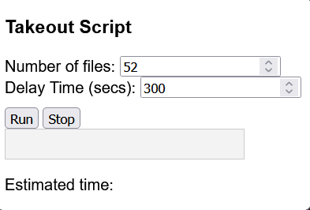

# Google Takeout Automation Extension
Use this extension to automate your google takeout file downloading.

## Description
Are you tired of Google's Takeout feature to give you 50 seperate buttons to click when you want to download your files.
By default each file is 2 GigaBytes, so you might be stuck there for hours to download your own data.

This Firefox extension (might work with Chromium, I didn't try) will make your life a bit easier.

## Getting Started

All you need to do is specify the total number of files and the delay between each file download.
Click `Run` and watch the files get downloaded automatically.

> **_NOTE_:**
You might need to log in to your google account again, after the first download link is clicked. Do this within the configured delay time so avoid problems. 

### Installing

Use the zip.cmd or favorite zipping tool to bundle the files into a addon.zip file.  
The extension can then be installed from [about:addons](about:addons).  

> **_NOTE_:**
If this is your first time installing an unsigned addon you build from source you might run into trouble installing.
You can permanently install unsigned extensions on Developer Edition by changing xpinstall.signatures.required to false in about:config. See this [answer](https://superuser.com/questions/956145/how-to-force-install-an-unverified-firefox-extension-in-41-0b1).

### How it works
The number of file you input into the numberfield is used to evaluate the [xpath](https://developer.mozilla.org/en-US/docs/Web/XPath)  `//a[contains(text(),' of ${numberField}')]`.   
This returned all buttons that you can click to download the files.  
The script then initiates a `.click()` action on each element, waiting the respective delay time between clicks.
The progress is tracked in the displayed progressbar.

While the script is running, the current configuration is saved to the local storage of the browser.

The estimated duration to download all files is based on the assumption that it takes on average 5 minutes to download a 2GB file. This is a very general assumption, but fits my personal experience.